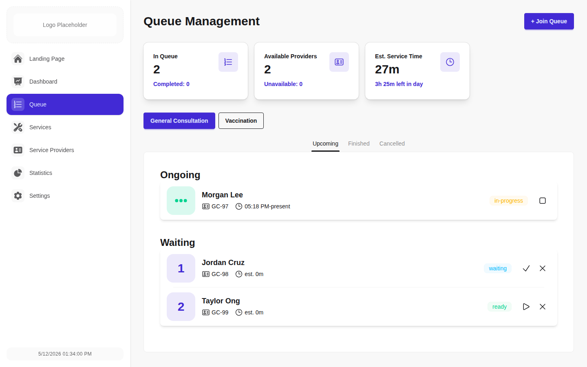
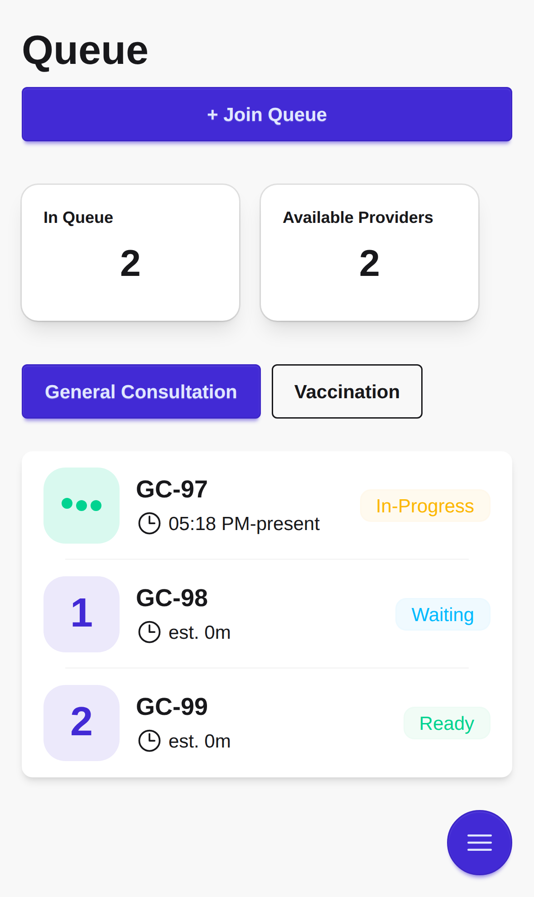

# Queue System

A web-based scheduling platform designed to improve patient and administrator experiences in environments where
technical infrastructure may be limited.

## Demo

- Video walkthrough (March 12, 2026): [YouTube Demo](https://www.youtube.com/watch?v=grjqZ2xFrk8)
- To try the latest interactive version of the demo, email: `fteodoro803@gmail.com`

## Screenshots

Auto-generated local screenshots:

<table>
  <tr>
    <td>
      <strong>Admin Queue</strong>
      <br />
      <a href="docs/screenshots/admin-queue.png">
        
      </a>
    </td>
    <td>
      <strong>Patient Queue (Mobile)</strong>
      <br />
      <a href="docs/screenshots/patient-queue-mobile.png">
        
      </a>
    </td>
  </tr>
</table>

## Why This Project Exists

Many clinics and service centers still run scheduling and queueing with fragmented tools (paper lists, spreadsheets, or
ad-hoc apps). That leads to missed updates, avoidable wait time, and friction between front-desk workflows and patient
expectations.

This project aims to provide a practical, modern baseline for:

- Faster check-in and queue visibility
- Cleaner day-to-day operations for staff
- Real-time updates across the app without manual refreshes
- A mobile-friendly experience that still works in constrained environments

## Product Philosophy

- **Reactive Data Sync:** Utilising Meteor to enable instant client-server synchronisation.
- **Mobile-First Design:** Optimised for low-bandwidth environments to ensure accessibility for all users.
- **Real-Time Availability:** Dynamic scheduling updates to prevent double-booking and reduce wait times.
- **Human-Centered Simplicity:** Clear, role-oriented screens for admins and patients.

## Core Capabilities

- Queue workflow management
- Provider, service, and patient record management
- Role-based navigation (admin and patient flows)
- Dashboard views and operational stats
- Configurable app settings and theme controls

## Tech Stack

### Frontend

- React 18 + TypeScript
- React Router 6
- Tailwind CSS 4 + DaisyUI
- Recharts (data visualisation)

### Backend / Runtime

- Meteor (publications, methods, and reactive data layer)
- MongoDB (via Meteor collections)

### Quality / Tooling

- ESLint + TypeScript ESLint
- Prettier
- Mocha + Chai (Meteor test driver)

## Project Structure (High-Level)

```text
client/                 # Client entry and styles
imports/api/            # Collections and Meteor methods
imports/ui/             # React UI: pages, components, navigation
imports/contexts/       # Shared client context providers
imports/utils/          # Utility modules
server/                 # Server startup and demo seed wiring
tests/                  # Unit + integration tests
```

## Automated Screenshot Updates

This repository includes `/.github/workflows/update-screenshots.yml`.

- Trigger: push to `release` (or manual `workflow_dispatch`)
- Flow: install Meteor + dependencies, start app, capture screenshots, commit updated files in `docs/screenshots/`
- Commit author: `github-actions[bot]`

Notes:

- `npm run screenshots:local` is the one-command flow for local development: start app, wait, capture all configured
  screenshots, stop app.
- `npm run screenshots` captures desktop screenshots.
- `npm run screenshots:mobile` captures mobile screenshots.
- `npm run screenshots` and `npm run screenshots:mobile` expect the app to already be running at
  `http://127.0.0.1:3000` (or `SCREENSHOT_BASE_URL`).